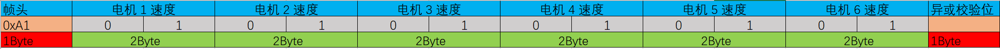
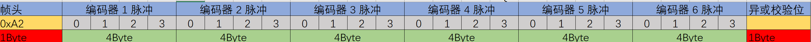
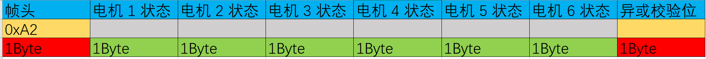

# 祖传协议

**BigEndian** 

## Nano 与 Arduino

UART：115200，无校验位，每字节8位，无流控制，停止位 1

### 电机速度控制

| Byte           | 内容        |
| -------------- | ----------- |
| 1              | 0xA1 帧头   |
| 2, 3, 4, 5     | 电机 1 速度 |
| 6, 7, 8, 9     | 电机 2 速度 |
| 10, 11, 12, 13 | 电机 3 速度 |
| 14, 15, 16, 17 | 电机 4 速度 |
| 18, 19, 20, 21 | 电机 5 速度 |
| 22, 23, 24, 25 | 电机 6 速度 |
| 26             | 异或校验位  |

一包 26 字节，按顺序带有六个电机速度，单速度占 4 字节，有符号。

### 编码器反馈

| Byte           | 内容          |
| -------------- | ------------- |
| 1              | 0xA2 帧头     |
| 2, 3, 4, 5     | 编码器 1 脉冲 |
| 6, 7, 8, 9     | 编码器 2 脉冲 |
| 10, 11, 12, 13 | 编码器 3 脉冲 |
| 14, 15, 16, 17 | 编码器 4 脉冲 |
| 18, 19, 20, 21 | 编码器 5 脉冲 |
| 22, 23, 24, 25 | 编码器 6 脉冲 |
| 26             | 异或校验位    |

一包 26 字节，按顺序带有六个编码器脉冲，单脉冲占 4 字节，有符号。

### 电机状态

| Byte | 内容        |
| ---- | ----------- |
| 1    | 0xA3 帧头   |
| 2    | 电机 1 状态 |
| 3    | 电机 2 状态 |
| 4    | 电机 3 状态 |
| 5    | 电机 4 状态 |
| 6    | 电机 5 状态 |
| 7    | 电机 6 状态 |
| 8    | 异或校验位  |

状态：

* `0x0` 停止
* `0x1` 制动
* `0x2` 闭速度环

一包 8 字节，按顺序带有六个电机状态。

### 机器人重置

| Byte | 内容      |
| ---- | --------- |
| 1    | 0xA8 帧头 |

仅一字节，无校验位。

## STM32 与 Arduino

SPI：

### 编码器反馈

